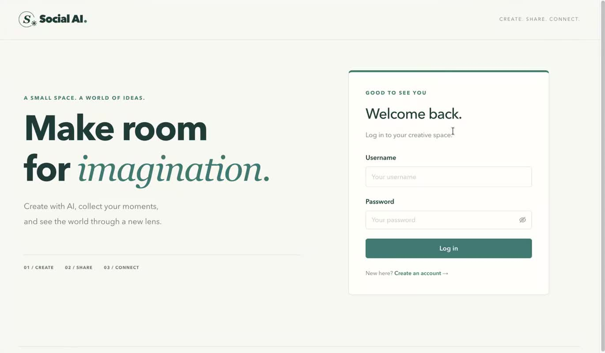
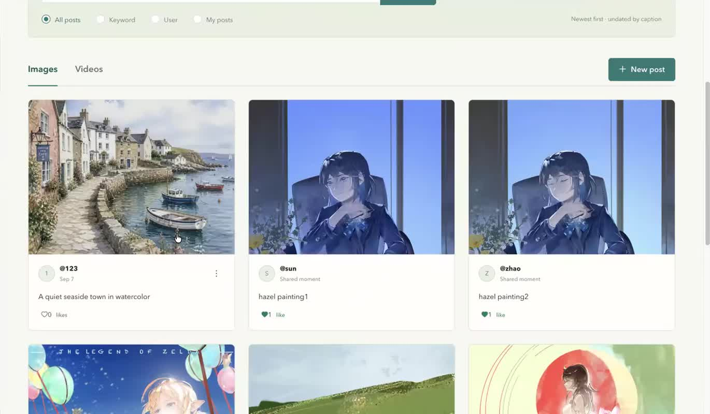
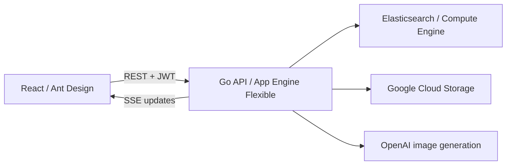

# SocialAI

A React and Go application for generating images with AI and sharing image and video posts. A responsive teal-and-ivory interface brings creation, a searchable gallery, and post interactions into one workflow.

**[Watch / download the demo](docs/demo/socialai-demo.mp4)** · [Demo walkthrough](docs/DEMO.md)



## Features

- **AI creation:** prompt → server-side OpenAI request → preview → caption → publish. The API key stays on the Go server. The current configuration uses GPT Image 2.
- **Media sharing:** upload one image or video up to 10 MB, browse a responsive gallery, and open full-size images with zoom and thumbnails.
- **Search:** Elasticsearch caption search, exact username filtering, and an authenticated “My posts” view.
- **Post interactions:** edit your own captions, like/unlike posts, and delete your own posts through a confirmation dialog. Ownership is enforced by the server.
- **Live feed updates:** authenticated server-sent events (SSE), backed by periodic comparisons against shared Elasticsearch data.
- **Authentication:** JWTs with expiration and revocable server-side sessions; bcrypt for newly registered users.



## Architecture



The frontend and API are separate applications. The recorded local demonstration connects a local React frontend to a deployed Google App Engine backend. This repository contains a portable configuration template rather than personal cloud endpoints or credentials.

## Repository layout

```text
frontend/    React UI, styles, and frontend tests
backend/     Go handlers, services, storage adapters, and tests
docs/        Screenshots and demo walkthrough
```

Open `socialai.code-workspace` in VS Code to work on both applications.

## Run locally

Prerequisites: Node.js and npm, Go 1.26.5 or a compatible newer toolchain, Python 3, an accessible Elasticsearch 7.x instance, and a Google Cloud Storage bucket with appropriate Application Default Credentials.

1. Configure and start the API:

   ```sh
   cd backend
   cp .env.example .env.local
   # Fill in ES_URL, GCS_BUCKET, JWT_SECRET, and the other server settings.
   # Use a randomly generated JWT_SECRET of at least 32 bytes.
   python3 scripts/run_local.py
   ```

   Set `OPENAI_API_KEY` to use image generation. Keep credentials in local configuration; do not commit them. Cloud resources and image generation may incur charges.

2. In another terminal, start React:

   ```sh
   cd frontend
   cp .env.example .env.development.local
   npm ci
   npm start
   ```

3. Open `http://localhost:3000` and create your own account. The frontend defaults to `http://127.0.0.1:8080`; set `REACT_APP_API_BASE_URL` to use another backend, then restart React.

See [backend setup and API details](backend/README.md) for storage configuration, isolated integration tests, and deployment preparation.

## Validation

```sh
cd frontend
CI=true npm test -- --watchAll=false --runInBand
npm run build

cd ../backend
go test ./...
```

Frontend tests cover generation errors and publishing, authentication, delete confirmation, search, SSE updates, and stable ordering of numbered legacy captions. Backend tests cover image API request contracts and JWT rejection. An opt-in integration suite uses isolated Elasticsearch and a GCS emulator to exercise upload/readback, pagination, ownership, edits, reactions, SSE, deletion, and session revocation. It does not use personal cloud data or paid image generation.

## Demo

See the [demo walkthrough](docs/DEMO.md) for the recorded flow and additional checks. The application supports both user-uploaded photos and AI-generated images.

## Implementation notes

- Built from a classroom React/Go project and extended with post interactions, server-side generation, sessions, live updates, and a redesigned responsive interface.
- The historical image integration used DALL·E; the current implementation uses configurable OpenAI image generation with `gpt-image-2` as the default.
- SSE checks for changes approximately every three seconds. It is not a millisecond-latency messaging system, and each connected view has a query cost.
- Old classroom records without timestamps are sorted naturally by caption within the loaded results. New posts remain newest first. This does not change server pagination boundaries.
- Legacy plaintext classroom passwords remain compatible with the shared original backend. New accounts use bcrypt; a legacy migration remains necessary before a production rollout.
- Object storage and Elasticsearch writes are not a distributed transaction. Load capacity, latency improvements, user-growth percentages, and zero downtime have not been established by this demo.

The visual design uses teal, ivory, fine dividers, and restrained typography. Reference artwork visible in screenshots and the demo is shown as sample post content; it is not bundled with the application as seed data or reusable UI assets.
